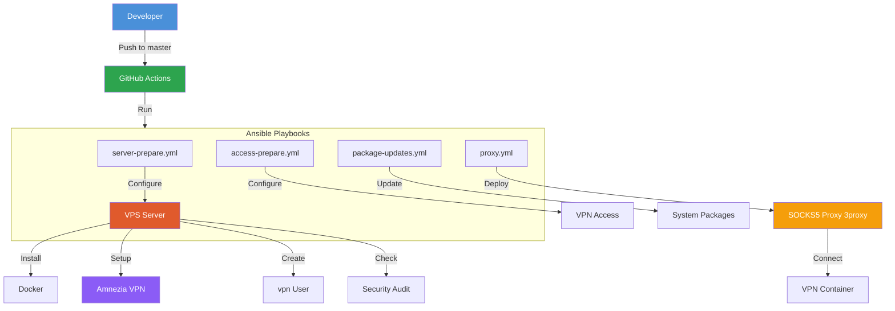

# 🛡️ VPN Deploy

**Ansible playbooks for automated VPN server deployment on VPS.**

This project automates setting up a server for [Amnezia VPN](https://github.com/amnezia-vpn/amnezia-client) with an additional SOCKS5 proxy (3proxy) and basic security auditing.

---

## 📋 Table of Contents

- [Architecture](#architecture)
- [Requirements](#requirements)
- [Quick Start](#quick-start)
- [Playbooks](#playbooks)
- [Variables](#variables)
- [Security](#security)
- [Project Structure](#project-structure)
- [Development](#development)
- [License](#license)

---

## Architecture



**Components:**

| Component | Purpose |
|---|---|
| **Amnezia VPN** | Main VPN server (Docker container) |
| **3proxy** | SOCKS5 proxy for additional use cases |
| **CrowdSec** | Intrusion detection and blocking system |
| **nftables** | Firewall (replacement for iptables) |

---

## Requirements

### Local Machine (where Ansible is run)

- **Python 3.10+**
- **Ansible 13.7+** (installed from `requirements.txt`)
- **SSH access** to the VPS server (key or password)

### Target Server (VPS)

- **OS:** RedHat family (AlmaLinux, Rocky Linux, RHEL 9+)
- **Architecture:** x86_64
- **Permissions:** root access or a user with sudo
- **Ports:** 22 (SSH) open to your IP

---

## Quick Start

### 1. Clone the Repository

```bash
git clone https://github.com/your-username/vpn-deploy.git
cd vpn-deploy
```

### 2. Install Dependencies

```bash
# Install Ansible
pip install -r requirements.txt

# Install Ansible collections
ansible-galaxy install -r requirements.yml
ansible-galaxy install -r ~/.ansible/collections/ansible_collections/pgalonza/linux/requirements.yml
```

### 3. Configure Inventory

Copy the example inventory and specify your server:

```bash
cp inventory.example.yml inventory/production.yml
```

Edit [`inventory/production.yml`](inventory.example.yml):

```yaml
all:
  hosts:
    my-vps:
      ansible_host: 123.123.123.123   # Your VPS IP
      ansible_user: root               # SSH user
      ansible_ssh_private_key_file: ~/.ssh/id_ed25519
```

### 4. Configure Variables

Copy the example variables file:

```bash
cp project-vars.example.yml vars/project-vars.yml
```

Edit [`vars/project-vars.yml`](project-vars.example.yml) to match your needs. At minimum, change the SOCKS5 proxy password.

### 5. Configure Secrets (Recommended)

Create a vault password file:

```bash
echo "my-strong-vault-password" > vault-password
chmod 600 vault-password
```

Encrypt sensitive data:

```bash
ansible-vault encrypt group_vars/vault.yml --vault-password-file vault-password
```

> **Important:** The `vault-password` file is in `.gitignore` and won't be committed.

### 6. Run Playbooks

Run playbooks strictly in the specified order:

```bash
# Step 1: Prepare the server (Docker, Amnezia, user)
ansible-playbook -i inventory/production.yml playbooks/server-prepare.yml

# Step 2: Configure VPN access
ansible-playbook -i inventory/production.yml playbooks/access-prepare.yml

# Step 3: Deploy SOCKS5 proxy
ansible-playbook -i inventory/production.yml playbooks/proxy.yml

# Step 4 (optional): Update system packages
ansible-playbook -i inventory/production.yml playbooks/package-updates.yml

# Step 5 (optional): Audit the server
ansible-playbook -i inventory/production.yml playbooks/server-audit.yml
```

If you encrypted the vault, add `--ask-vault-pass` or `--vault-password-file vault-password`:

```bash
ansible-playbook -i inventory/production.yml playbooks/server-prepare.yml --vault-password-file vault-password
```

---

## Playbooks

### [`server-prepare.yml`](playbooks/server-prepare.yml)

Initial server setup. Runs **once** on a fresh server.

**What it does:**
- Generates Ed25519 SSH keys for the VPN user
- Creates a `vpn` system user with `sudo` and `docker` groups
- Configures Docker with nftables dependency
- Installs `docker` and `security` roles from the `pgalonza.linux` collection
- Downloads and configures the Amnezia firewall script
- Creates a systemd unit for automatic firewall startup
- Pins Docker and CrowdSec package versions

### [`access-prepare.yml`](playbooks/access-prepare.yml)

VPN access configuration.

**What it does:**
- Disables Firewalld (replaced by nftables)
- Applies the `prepare` role from the `pgalonza.linux` collection

### [`proxy.yml`](playbooks/proxy.yml)

SOCKS5 proxy (3proxy) deployment.

**What it does:**
- Creates the docker-compose directory for the proxy
- Deploys the 3proxy container with a templated configuration
- Installs Python dependencies (`requests`)
- Connects the VPN container to the proxy network

### [`package-updates.yml`](playbooks/package-updates.yml)

System package updates for the VPN server.

**What it does:**
- Updates all system packages to their latest versions
- Applies the `package_updates` role from the `pgalonza.linux` collection

### [`server-audit.yml`](playbooks/server-audit.yml)

Server security audit.

**What it does:**
- Checks the server configuration against security best practices
- Applies the `audit` role from the `pgalonza.linux` collection

---

## Variables

### Main Variables ([`vars/project-vars.yml`](project-vars.example.yml))

| Variable | Default | Description |
|---|---|---|
| `vpn_user` | `vpn` | System user for VPN |
| `ssh_key_dir` | `~/.ssh` | SSH key directory |
| `docker_edition` | `ce` | Docker edition |
| `crowdsec_firewall_bouncer_type` | `nftables` | CrowdSec bouncer type |
| `socks_proxy_version` | `0.9.6` | 3proxy image version |
| `socks_proxy_port` | `8080` | SOCKS5 proxy port |
| `socks_proxy_dir` | `socks-proxy` | docker-compose directory |
| `socks_proxy_users` | — | Proxy users (name/password) |
| `vpn_container_name` | `vpn` | Amnezia container name |
| `pip_packages_version` | `21.3.1` | python3-pip version |
| `requests_version` | `2.32.5` | requests library version |

### Vault Variables ([`group_vars/vault.yml`](group_vars/vault.yml))

| Variable | Description |
|---|---|
| `vault_socks_proxy_users` | SOCKS5 proxy users list (encrypted) |

---

## Security

### Ansible Vault

Sensitive data (proxy user passwords) is stored in the encrypted file [`group_vars/vault.yml`](group_vars/vault.yml).

**Working with vault:**

```bash
# Edit the encrypted file
ansible-vault edit group_vars/vault.yml --vault-password-file vault-password

# Decrypt (e.g., for viewing)
ansible-vault decrypt group_vars/vault.yml --vault-password-file vault-password

# Re-encrypt
ansible-vault encrypt group_vars/vault.yml --vault-password-file vault-password
```

### Recommendations

1. **Never commit** `vars/project-vars.yml`, `inventory/production.yml`, or `vault-password` to the repository
2. **Use different passwords** for each server
3. **Restrict SSH access** by IP (in your hosting provider's firewall)
4. **Regularly update** Docker images and OS packages
5. **Use SSH keys** instead of passwords for server access

---

## Project Structure

```
vpn-deploy/
├── .github/workflows/
│   └── prepare.yml              # CI/CD: dependency installation
├── files/
│   └── setup-host-firewall.service  # systemd unit for Amnezia firewall
├── group_vars/
│   ├── all.yml                   # Common variables
│   └── vault.yml                 # 🔒 Encrypted secrets
├── inventory/
│   ├── production.yml            # 🔒 Your inventory (in .gitignore)
│   └── example/
│       └── inventory.yml         # Inventory example
├── playbooks/
│   ├── access-prepare.yml        # VPN access configuration
│   ├── package-updates.yml       # System package updates
│   ├── proxy.yml                 # SOCKS5 proxy deployment
│   ├── server-audit.yml          # Server audit
│   └── server-prepare.yml        # Server preparation
├── templates/
│   └── socks-proxy/
│       └── docker-compose.yml.j2 # 3proxy docker-compose template
├── vars/
│   ├── project-vars.yml          # 🔒 Your variables (in .gitignore)
│   └── example/
│       └── project-vars.yml      # Variables example
├── plans/
│   └── refactoring-plan.md       # Refactoring plan
├── project-vars.example.yml      # Example variables (for copying)
├── inventory.example.yml         # Example inventory (for copying)
├── requirements.yml              # Ansible dependencies (collections)
├── requirements.txt              # Python dependencies (Ansible)
├── ansible.cfg                   # Ansible configuration
├── README.md                     # This file
├── LICENSE.txt                   # Apache 2.0
└── .gitignore                    # Ignored files
```

**Legend:**
- 🔒 — files added to `.gitignore` (not committed to the repository)

---

## Development

### Local Testing

Use Vagrant or Docker for development and testing:

```bash
# Example with Vagrant (AlmaLinux)
vagrant init almalinux/9
vagrant up
ansible-playbook -i inventory/vagrant.yml playbooks/server-prepare.yml
```

### Syntax Check

```bash
ansible-playbook --syntax-check playbooks/server-prepare.yml
ansible-lint playbooks/
```

### Contributing

1. Create a branch: `git checkout -b feature/my-feature`
2. Make your changes
3. Check syntax: `ansible-playbook --syntax-check playbooks/*.yml`
4. Create a Pull Request

---

## CI/CD

GitHub Actions automatically checks playbook syntax on pushes to the `master` branch.

See [`.github/workflows/prepare.yml`](.github/workflows/prepare.yml).

---

## License

This project is licensed under the Apache License 2.0. See [`LICENSE.txt`](LICENSE.txt) for details.