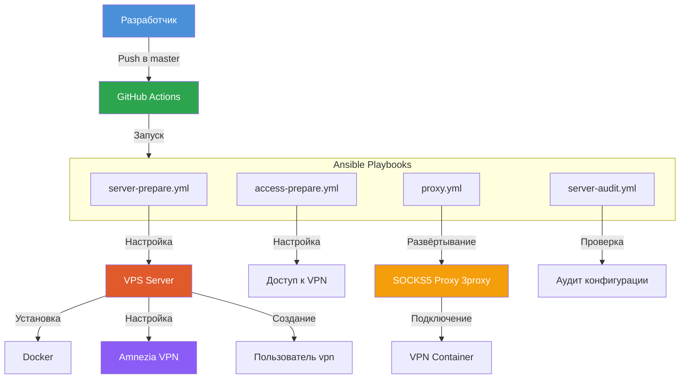

# План рефакторинга проекта vpn-deploy

## Текущая структура проекта

```
vpn-deploy/
├── .github/workflows/prepare.yml    # CI/CD для подготовки сервера
├── files/
│   └── setup-host-firewall.service   # systemd unit для Amnezia firewall
├── group_vars/
│   └── all.yml                       # Общие переменные (в т.ч. пароль socks-proxy)
├── templates/
│   └── socks-proxy/
│       └── docker-compose.yml.j2     # Шаблон docker-compose для 3proxy
├── access-prepare.yml                # Плейбук: настройка доступа к VPN
├── proxy.yml                         # Плейбук: развёртывание SOCKS5-прокси
├── server-audit.yml                  # Плейбук: аудит сервера
├── server-prepare.yml                # Плейбук: подготовка сервера (Docker, Amnezia, пользователь)
├── requirements.yml                  # Зависимости Ansible (коллекции)
├── requirements.txt                  # Зависимости Python (Ansible)
├── LICENSE.txt                       # Apache 2.0
├── .gitignore                        # Игнорируемые файлы
├── project-vars.yml                  # 🔒 Личные переменные проекта
├── inventory.yml                     # 🔒 Инвентарь хостов
└── audit/                            # 🔒 Результаты аудита
```

## Проблемы текущей структуры

1. **Плейбуки в корне** — все `.yml` файлы лежат в корне, нет разделения на логические директории
2. **Чувствительные данные в открытом виде** — пароль `socks-proxy` хранится в `group_vars/all.yml` в plaintext
3. **Закомментированный код** — в `server-prepare.yml` есть закомментированные блоки (строки 66-80)
4. **Нет example-файлов** — `project-vars.yml` и `inventory.yml` скрыты, но нет шаблонов для новых пользователей
5. **Нет README** — отсутствует документация по использованию проекта
6. **Нет разделения по окружениям** — `group_vars/all.yml` один на все окружения

## Целевая структура проекта

```
vpn-deploy/
├── .github/workflows/
│   └── prepare.yml                   # CI/CD (без изменений)
├── files/
│   └── setup-host-firewall.service   # systemd unit (без изменений)
├── group_vars/
│   ├── all.yml                       # Общие переменные (без секретов)
│   └── vault.yml                     # Зашифрованные секреты (Ansible Vault)
├── inventory/
│   ├── production.yml                # Инвентарь для production
│   └── example/
│       └── inventory.yml             # Пример инвентаря
├── playbooks/
│   ├── access-prepare.yml            # Плейбук: настройка доступа
│   ├── proxy.yml                     # Плейбук: развёртывание прокси
│   ├── server-audit.yml              # Плейбук: аудит сервера
│   └── server-prepare.yml            # Плейбук: подготовка сервера
├── templates/
│   └── socks-proxy/
│       └── docker-compose.yml.j2     # Шаблон (без изменений)
├── vars/
│   ├── project-vars.yml              # 🔒 Личные переменные
│   └── example/
│       └── project-vars.yml          # Пример переменных
├── requirements.yml                  # Зависимости Ansible
├── requirements.txt                  # Зависимости Python
├── ansible.cfg                       # Конфигурация Ansible
├── README.md                         # Документация
├── LICENSE.txt                       # Apache 2.0
├── .gitignore                        # Обновлённый
└── vault-password                    # 🔒 Файл с паролем vault (в .gitignore)
```

## Пошаговый план рефакторинга

### Шаг 1: Реорганизация структуры директорий

- Создать директории: `playbooks/`, `inventory/`, `inventory/example/`, `vars/`, `vars/example/`
- Переместить плейбуки (`*.yml` в корне) в `playbooks/`
- Создать `ansible.cfg` с базовой конфигурацией

### Шаг 2: Создание example-файлов

- Создать `vars/example/project-vars.yml` — шаблон с комментариями по каждой переменной
- Создать `inventory/example/inventory.yml` — пример инвентаря с комментариями

### Шаг 3: Вынос секретов в Ansible Vault

- Создать `group_vars/vault.yml` с зашифрованными секретами:
  - `vault_socks_proxy_users` — список пользователей socks-proxy
- Очистить `group_vars/all.yml` от чувствительных данных
- Создать `vault-password` (добавить в `.gitignore`)
- Обновить шаблон `docker-compose.yml.j2` для использования vault-переменных

### Шаг 4: Очистка кода плейбуков

- **server-prepare.yml:**
  - Удалить закомментированные блоки (строки 66-80)
  - Улучшить именование тасков (более описательные названия)
  - Разделить на логические секции с комментариями
- **proxy.yml:**
  - Улучшить читаемость, добавить секции
  - Использовать vault-переменные для аутентификации
- **access-prepare.yml:**
  - Добавить проверки (when) для idempotency
- **server-audit.yml:**
  - Минимальные изменения (структура уже хорошая)

### Шаг 5: Обновление .gitignore

- Добавить: `vault-password`, `inventory/production.yml`, `vars/project-vars.yml`
- Убедиться, что example-файлы не игнорируются

### Шаг 6: Написание README.md

Структура README:
1. **Описание проекта** — что это и зачем
2. **Архитектура** — схема взаимодействия компонентов
3. **Требования** — что нужно для использования
4. **Быстрый старт** — пошаговая инструкция
5. **Плейбуки** — описание каждого плейбука
6. **Переменные** — описание всех переменных
7. **Безопасность** — как работают секреты (vault)
8. **CI/CD** — описание GitHub Actions
9. **Разработка** — как вносить изменения

## Схема архитектуры



## Переменные для vault

| Переменная | Описание | Пример значения |
|---|---|---|
| `vault_socks_proxy_users` | Список пользователей socks-proxy | `[{name: socks, password: socks}]` |
| `vault_vpn_user_password` | Пароль VPN пользователя | `supersecret` |

## Обновлённый group_vars/all.yml

```yaml
# Версии и пути (не секретные)
socks_proxy_version: 0.9.6
socks_proxy_port: 8080
requests_version: 2.32.5
pip_packages_version: 21.3.1
vpn_container_name: vpn
socks_proxy_dir: socks-proxy

# Ссылки на vault
socks_proxy_users: "{{ vault_socks_proxy_users }}"
```

## Критерии готовности

- [ ] Все плейбуки перемещены в `playbooks/`
- [ ] Созданы example-файлы для `project-vars.yml` и `inventory.yml`
- [ ] Секреты вынесены в `group_vars/vault.yml` и зашифрованы
- [ ] Код плейбуков очищен от комментариев и улучшен
- [ ] `.gitignore` обновлён
- [ ] `README.md` написан и содержит полную инструкцию
- [ ] `ansible.cfg` создан